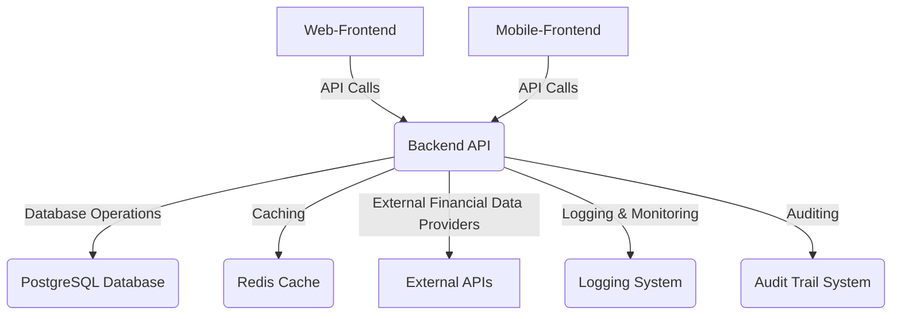

# RiskOptimizer System Design Document

## 1. Introduction

This document outlines the system design of the RiskOptimizer application, focusing on its architecture, components, data flow, and key technologies. The RiskOptimizer is a financial application designed to help users manage and optimize their investment portfolios by providing risk analysis, portfolio management, and efficient frontier calculations. This enhanced version prioritizes financial standards, robust security, and compliance.

## 2. Architecture Overview

The RiskOptimizer application follows a microservices-oriented architecture, composed of a backend API, a web-frontend, and a mobile-frontend. These components interact with each other and with external services to provide a comprehensive financial risk optimization platform.

### 2.1. High-Level Diagram

## 3. Component Breakdown

### 3.1. Backend API

The backend API is the core of the application, responsible for business logic, data processing, and interaction with the database and external services. It is built using Python with Flask.

#### 3.1.1. Key Modules and Services

*   **`app.py`**: The main Flask application entry point, responsible for setting up routes, middleware, and configurations.
*   **`core/`**: Contains core functionalities such as configuration management (`config.py`), custom exceptions (`exceptions.py`), and logging utilities (`logging.py`).
*   **`api/`**: Defines API endpoints, request/response schemas, and middleware.
    *   **`controllers/`**: Handles incoming HTTP requests, validates input, calls appropriate services, and returns responses.
        *   `auth_controller.py`: Manages user authentication (login, registration, logout, token refresh).
        *   `portfolio_controller.py`: Manages user portfolios (creation, retrieval, update, deletion, allocation management).
        *   `risk_controller.py`: Exposes endpoints for risk analysis and efficient frontier calculations.
    *   **`schemas/`**: Defines data models for request and response payloads using Pydantic for validation and serialization.
    *   **`middleware/`**: Implements cross-cutting concerns such as authentication, error handling, and CSRF protection.
        *   `auth_middleware.py`: Validates JWT tokens and authenticates users for protected routes.
        *   `error_middleware.py`: Centralized error handling to provide consistent error responses.
        *   `csrf_middleware.py`: Protects against Cross-Site Request Forgery attacks.
*   **`domain/`**: Encapsulates the core business logic and domain models.
    *   **`services/`**: Contains the main business logic for different domains.
        *   `auth_service.py`: Handles user authentication, password hashing, token generation, and account lockout logic.
        *   `portfolio_service.py`: Manages portfolio creation, updates, and asset allocations.
        *   `risk_service.py`: Performs complex financial risk calculations (VaR, CVaR, Sharpe Ratio, Max Drawdown, Efficient Frontier).
        *   `audit_service.py`: Records critical system and user actions for compliance and security auditing.
*   **`infrastructure/`**: Manages external dependencies and persistence.
    *   **`database/`**: Handles database interactions.
        *   `models.py`: SQLAlchemy ORM models defining the database schema (User, Portfolio, Allocation, AuditLog).
        *   `session.py`: Manages database sessions.
        *   `repositories/`:

            *   `user_repository.py`: CRUD operations for User data, including encryption/decryption of sensitive fields.
            *   `portfolio_repository.py`: CRUD operations for Portfolio and Allocation data.
            *   `audit_repository.py`: Stores audit logs.
    *   **`cache/`**: Integration with Redis for caching frequently accessed data.
        *   `redis_cache.py`: Redis client setup and basic caching operations.
    *   **`third_party/`**: Integration with external APIs for financial data (e.g., market data, asset prices).
*   **`utils/`**: Contains utility functions, such as caching decorators (`cache_utils.py`).
*   **`db/`**: Contains database schema definition (`schema.sql`).

#### 3.1.2. Technologies Used

*   **Python**: Primary programming language.
*   **Flask**: Web framework for building the API.
*   **SQLAlchemy**: ORM for database interactions.
*   **PostgreSQL**: Relational database for persistent storage.
*   **Redis**: In-memory data store for caching and session management.
*   **PyPortfolioOpt**: Library for portfolio optimization and efficient frontier calculations.
*   **Numpy, Scipy, Pandas**: For numerical computations and data manipulation.
*   **PyJWT, Bcrypt**: For secure authentication and password hashing.
*   **Flasgger**: For generating OpenAPI (Swagger) documentation.
*   **Cryptography**: For data encryption (e.g., Fernet for wallet addresses).

### 3.2. Web-Frontend

The web-frontend provides a user-friendly interface for interacting with the backend API. It is built using React.

#### 3.2.1. Key Components

*   **React**: JavaScript library for building user interfaces.
*   **Redux/Context API**: For state management.
*   **React Router**: For navigation.
*   **Axios**: For making HTTP requests to the backend API.
*   **Chart.js/D3.js**: For data visualization (e.g., portfolio performance, efficient frontier).

### 3.3. Mobile-Frontend

The mobile-frontend provides a native-like experience for users on mobile devices. It is built using React Native.

#### 3.3.1. Key Components

*   **React Native**: Framework for building cross-platform mobile applications.
*   **Redux/Context API**: For state management.
*   **React Navigation**: For navigation.
*   **Axios**: For making HTTP requests to the backend API.
*   **Mobile Charting Libraries**: For data visualization on mobile.

### 3.4. Infrastructure

The infrastructure components support the deployment and operation of the application.

#### 3.4.1. Key Components

*   **Docker**: For containerization of the application components (backend, PostgreSQL, Redis).
*   **Docker Compose**: For defining and running multi-container Docker applications.
*   **NGINX**: As a reverse proxy for the backend API, handling SSL termination and load balancing.
*   **Cloud Provider (e.g., AWS, GCP, Azure)**: For hosting the application (VMs, managed databases, container orchestration services).
*   **CI/CD Pipeline (e.g., Jenkins, GitLab CI, GitHub Actions)**: For automated testing, building, and deployment.

## 4. Data Flow

1.  **User Interaction**: Users interact with the Web-Frontend or Mobile-Frontend.
2.  **API Request**: Frontend applications send API requests to the Backend API.
3.  **Authentication/Authorization**: The Backend API uses `auth_middleware` to verify JWT tokens and `auth_service` for user authentication and authorization.
4.  **Input Validation**: Request data is validated against defined schemas (Pydantic).
5.  **Business Logic Execution**: Controllers invoke relevant services (`portfolio_service`, `risk_service`, `auth_service`) to execute business logic.
6.  **Data Persistence**: Services interact with repositories (`user_repository`, `portfolio_repository`) to perform CRUD operations on the PostgreSQL database.
    *   Sensitive data (e.g., wallet addresses) are encrypted before storage and decrypted upon retrieval.
7.  **Caching**: Frequently accessed data is cached in Redis via `redis_cache` to improve performance.
8.  **External Data**: `third_party` integrations fetch real-time financial data from external APIs.
9.  **Auditing**: Critical actions and data modifications are logged by `audit_service` to the `AuditLog` table for compliance and security monitoring.
10. **Logging**: Comprehensive logging (`logging.py`) captures application events, errors, and warnings.
11. **Error Handling**: `error_middleware` ensures consistent error responses.
12. **API Response**: The Backend API sends responses back to the frontend applications.

## 5. Security Features

*   **Authentication**: JWT-based authentication with secure token generation, verification, and blacklisting.
*   **Authorization**: Role-based access control (RBAC) to restrict access to certain functionalities based on user roles.
*   **Password Security**: Bcrypt hashing for passwords with configurable rounds, preventing rainbow table attacks.
*   **Data Encryption**: Sensitive data (e.g., wallet addresses) encrypted at rest using Fernet symmetric encryption.
*   **Input Validation**: Strict input validation on all API endpoints to prevent injection attacks (SQL, XSS).
*   **CSRF Protection**: CSRF tokens implemented for state-changing requests.
*   **Rate Limiting**: (Planned) To prevent brute-force attacks and abuse of API endpoints.
*   **Secure Communication**: HTTPS/SSL for all communication between frontend and backend.
*   **Logging and Monitoring**: Comprehensive logging of security-relevant events (login attempts, data access, modifications) and integration with monitoring tools.
*   **Error Handling**: Graceful error handling to avoid leaking sensitive information in error messages.

## 6. Compliance Features

*   **Audit Trails**: Detailed audit logs for all financial transactions and critical user actions, including timestamps, user IDs, action types, and affected entities. This supports regulatory compliance requirements for traceability and accountability.
*   **Data Privacy**: Implementation of data encryption for sensitive personal and financial data. Adherence to principles of data minimization.
*   **Access Control**: Granular access control mechanisms ensure that only authorized users can access specific data and functionalities, supporting compliance with regulations like GDPR and CCPA.
*   **Data Integrity**: Use of database transactions and validation to ensure the accuracy and consistency of financial data.
*   **Secure Development Practices**: Adherence to secure coding guidelines and regular security reviews.

## 7. Future Enhancements

*   **Advanced Analytics**: Integration of more sophisticated financial models and predictive analytics.
*   **Real-time Data Streaming**: Implement WebSocket for real-time market data updates.
*   **Multi-factor Authentication (MFA)**: Add an extra layer of security for user logins.
*   **Automated Security Scans**: Integrate static and dynamic application security testing (SAST/DAST) into the CI/CD pipeline.
*   **Compliance Reporting**: Develop automated reports to demonstrate adherence to financial regulations.
*   **Scalability Improvements**: Implement microservices orchestration (e.g., Kubernetes) for better scalability and resilience.

## 8. Conclusion

This system design document provides a comprehensive overview of the RiskOptimizer application, highlighting its robust architecture, enhanced security, and compliance features. The design aims to deliver a reliable, secure, and high-performance platform for financial risk optimization, meeting industry standards and user expectations.

