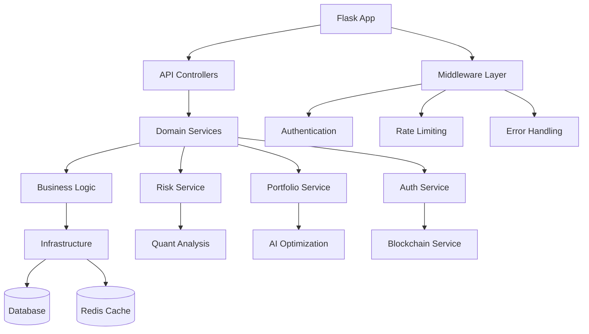

# Architecture Overview

System architecture and design documentation for RiskOptimizer.

## Table of Contents

- [High-Level Architecture](#high-level-architecture)
- [Component Diagram](#component-diagram)
- [Module Structure](#module-structure)
- [Data Flow](#data-flow)
- [Technology Stack](#technology-stack)
- [Design Patterns](#design-patterns)

## High-Level Architecture

RiskOptimizer follows a **microservices-oriented** architecture with clear separation of concerns:

```
┌─────────────────────────────────────────────────────────────┐
│                        Client Layer                          │
├──────────────────┬──────────────────┬──────────────────────┤
│  Web Dashboard   │   Mobile App     │   API Clients        │
│  (React)         │  (React Native)  │   (3rd party)        │
└──────┬───────────┴────────┬─────────┴──────────┬───────────┘
       │                    │                     │
       └────────────────────┼─────────────────────┘
                            │
                    ┌───────▼────────┐
                    │   API Gateway  │
                    │   (Flask +     │
                    │    Middleware) │
                    └───────┬────────┘
                            │
       ┌────────────────────┼────────────────────┐
       │                    │                    │
   ┌───▼────┐        ┌─────▼──────┐     ┌──────▼──────┐
   │ Risk   │        │ Portfolio  │     │    Auth     │
   │Service │        │  Service   │     │   Service   │
   └───┬────┘        └─────┬──────┘     └──────┬──────┘
       │                   │                    │
       └───────────────────┼────────────────────┘
                           │
       ┌───────────────────┼────────────────────┬──────────┐
       │                   │                    │          │
   ┌───▼────┐       ┌──────▼──────┐     ┌──────▼──────┐  │
   │   AI   │       │  Blockchain │     │   Database  │  │
   │ Models │       │  Integration│     │ PostgreSQL/ │  │
   │        │       │  (Web3)     │     │   SQLite    │  │
   └───┬────┘       └─────────────┘     └─────────────┘  │
       │                                                   │
   ┌───▼────────┐                               ┌─────────▼───┐
   │   Celery   │                               │    Redis    │
   │   Worker   │◄──────────────────────────────┤   (Cache)   │
   └────────────┘                               └─────────────┘
```

## Component Diagram

### Backend Components



### Frontend Architecture

```
web-frontend/
├── src/
│   ├── components/          # React components
│   │   ├── dashboard/       # Dashboard views
│   │   ├── auth/            # Authentication
│   │   └── shared/          # Reusable components
│   ├── services/            # API clients
│   ├── store/               # Redux state management
│   ├── utils/               # Helper functions
│   └── App.jsx              # Root component
```

## Module Structure

### Backend Module Mapping

| Module                | File Path                                     | Responsibility                    | Dependencies       |
| --------------------- | --------------------------------------------- | --------------------------------- | ------------------ |
| **App Entry**         | `code/backend/app.py`                         | Flask app initialization, routing | Flask, Blueprints  |
| **API Controllers**   | `code/backend/riskoptimizer/api/controllers/` | HTTP request handling             | Schemas, Services  |
| **- Auth**            | `auth_controller.py`                          | User authentication endpoints     | Auth Service       |
| **- Risk**            | `risk_controller.py`                          | Risk calculation endpoints        | Risk Service       |
| **- Portfolio**       | `portfolio_controller.py`                     | Portfolio management              | Portfolio Service  |
| **- Monitoring**      | `monitoring_controller.py`                    | System monitoring                 | Performance Utils  |
| **Middleware**        | `code/backend/riskoptimizer/api/middleware/`  | Request/response processing       | -                  |
| **- Auth MW**         | `auth_middleware.py`                          | JWT validation                    | PyJWT              |
| **- Rate Limit**      | `rate_limit_middleware.py`                    | Request throttling                | Redis              |
| **- Error MW**        | `error_middleware.py`                         | Error handling                    | Custom Exceptions  |
| **Schemas**           | `code/backend/riskoptimizer/api/schemas/`     | Request validation                | -                  |
| **Domain Services**   | `code/backend/riskoptimizer/domain/services/` | Business logic                    | -                  |
| **- Risk Service**    | `risk_service.py`                             | Risk calculations                 | Quant Analysis     |
| **- Portfolio Svc**   | `portfolio_service.py`                        | Portfolio operations              | Repository         |
| **- Auth Service**    | `auth_service.py`                             | Authentication logic              | Bcrypt, JWT        |
| **Core**              | `code/backend/riskoptimizer/core/`            | Core utilities                    | -                  |
| **- Config**          | `config.py`                                   | Configuration management          | python-dotenv      |
| **- Logging**         | `logging.py`                                  | Structured logging                | structlog          |
| **- Exceptions**      | `exceptions.py`                               | Custom exception classes          | -                  |
| **Infrastructure**    | `code/backend/riskoptimizer/infrastructure/`  | External integrations             | -                  |
| **- Database**        | `database/`                                   | ORM models, repositories          | SQLAlchemy         |
| **- Cache**           | `cache/redis_cache.py`                        | Redis caching                     | redis-py           |
| **Services**          | `code/backend/riskoptimizer/services/`        | Specialized services              | -                  |
| **- Quant Analysis**  | `quant_analysis.py`                           | Mathematical calculations         | NumPy, SciPy       |
| **- AI Optimization** | `ai_optimization.py`                          | ML-based optimization             | scikit-learn       |
| **- Blockchain**      | `blockchain_service.py`                       | Web3 integration                  | web3.py            |
| **Tasks**             | `code/backend/riskoptimizer/tasks/`           | Async tasks                       | Celery             |
| **- Celery App**      | `celery_app.py`                               | Celery configuration              | -                  |
| **- Maintenance**     | `maintenance_tasks.py`                        | Background jobs                   | -                  |
| **Risk Models**       | `code/risk_models/`                           | Standalone risk calculations      | -                  |
| **AI Models**         | `code/ai_models/`                             | ML model training & inference     | TensorFlow/PyTorch |
| **Blockchain**        | `code/blockchain/`                            | Smart contracts & Web3            | Solidity, Hardhat  |

## Data Flow

### Request Flow (API Call)

```
1. Client sends HTTP request
   ↓
2. Flask receives request
   ↓
3. Rate limit middleware checks limits
   ↓
4. Auth middleware validates JWT token
   ↓
5. Request reaches controller
   ↓
6. Controller validates request schema
   ↓
7. Controller calls domain service
   ↓
8. Service executes business logic
   ↓
9. Service checks Redis cache
   ├─ Hit: Return cached result
   └─ Miss: Continue
      ↓
   10. Service performs calculations
       ↓
   11. Service stores result in cache
       ↓
   12. Service persists to database (if needed)
       ↓
   13. Result returns through layers
       ↓
   14. Controller formats response
       ↓
   15. Error middleware catches exceptions
       ↓
   16. Response sent to client
```

### VaR Calculation Flow Example

```python
# 1. API Request
POST /api/v1/risk/var
Body: {"returns": [...], "confidence": 0.95}

# 2. Controller Layer
risk_controller.calculate_var()
  ├─ Validate request schema
  └─ Call service

# 3. Service Layer
risk_service.calculate_var(returns, confidence)
  ├─ Validate inputs
  ├─ Check cache (key: "var:{hash}:{confidence}")
  ├─ If miss: Calculate using quant_analysis
  │   └─ RiskMetrics.calculate_var()
  │       └─ np.percentile(returns, (1-confidence)*100)
  ├─ Store in cache (TTL: 3600s)
  └─ Return result

# 4. Response
{"status": "success", "data": {"var": -0.0234, ...}}
```

## Technology Stack

### Backend Technologies

| Technology       | Version | Purpose              | Module           |
| ---------------- | ------- | -------------------- | ---------------- |
| **Python**       | 3.8+    | Backend language     | All              |
| **Flask**        | 3.0.0   | Web framework        | API Layer        |
| **SQLAlchemy**   | 2.0.23  | ORM                  | Database         |
| **PostgreSQL**   | 12+     | Production database  | Data Storage     |
| **SQLite**       | 3+      | Development database | Data Storage     |
| **Redis**        | 5+      | Caching & tasks      | Infrastructure   |
| **Celery**       | 5.3.4   | Async tasks          | Background Jobs  |
| **NumPy**        | 1.26+   | Numerical computing  | Calculations     |
| **Pandas**       | 2.1+    | Data manipulation    | Data Processing  |
| **scikit-learn** | 1.3+    | Machine learning     | AI Models        |
| **PyJWT**        | 2.8.0   | JWT tokens           | Authentication   |
| **Web3.py**      | 6.0+    | Blockchain           | Web3 Integration |

### Frontend Technologies

| Technology       | Version | Purpose            | Module        |
| ---------------- | ------- | ------------------ | ------------- |
| **React**        | 18+     | Web UI framework   | Web Frontend  |
| **React Native** | 0.72+   | Mobile framework   | Mobile App    |
| **Redux**        | 4.2+    | State management   | State         |
| **D3.js**        | 7+      | Data visualization | Charts        |
| **Recharts**     | 2+      | React charts       | Visualization |
| **Axios**        | 1.5+    | HTTP client        | API Calls     |
| **ethers.js**    | 6+      | Web3 frontend      | Blockchain UI |

### Infrastructure

| Technology         | Purpose                       |
| ------------------ | ----------------------------- |
| **Docker**         | Containerization              |
| **Docker Compose** | Multi-container orchestration |
| **GitHub Actions** | CI/CD pipeline                |
| **Prometheus**     | Metrics collection            |
| **Sentry**         | Error tracking                |

## Design Patterns

### Architecture Patterns

**1. Layered Architecture**

- Presentation (Controllers)
- Business Logic (Domain Services)
- Data Access (Repositories)
- Infrastructure (External Services)

**2. Repository Pattern**

- Abstracts data access logic
- Files: `infrastructure/database/repositories/`

**3. Service Layer Pattern**

- Encapsulates business logic
- Files: `domain/services/`

**4. Dependency Injection**

- Loose coupling between components
- Example: Services injected into controllers

**5. Middleware Pattern**

- Cross-cutting concerns (auth, logging, errors)
- Files: `api/middleware/`

### Code Patterns

**1. Error Handling**

```python
# Custom exceptions
class RiskOptimizerException(Exception):
    pass

class ValidationError(RiskOptimizerException):
    pass

# Consistent error responses
{
  "status": "error",
  "error": {
    "code": "VALIDATION_ERROR",
    "message": "...",
    "field": "..."
  }
}
```

**2. Caching Pattern**

```python
@memoize(ttl=3600)
def expensive_calculation(...):
    # Result cached for 1 hour
    pass
```

**3. API Response Pattern**

```python
{
  "status": "success",
  "message": "Optional message",
  "data": {...},
  "meta": {...}
}
```

## Security Architecture

### Authentication Flow

```
1. User registers → Password hashed (bcrypt, 12 rounds)
2. User logs in → Credentials validated
3. Server issues JWT access token (1h) + refresh token (30d)
4. Client stores tokens securely
5. Client includes access token in Authorization header
6. Middleware validates token on each request
7. Token refresh before expiry using refresh token
8. Logout blacklists both tokens in Redis
```

### Security Layers

| Layer                | Mechanism          | Implementation              |
| -------------------- | ------------------ | --------------------------- |
| **Transport**        | HTTPS              | Nginx/Load Balancer         |
| **Authentication**   | JWT                | `auth_middleware.py`        |
| **Authorization**    | Role-based         | `@admin_required` decorator |
| **Input Validation** | Schema validation  | `schemas/`                  |
| **Rate Limiting**    | Token bucket       | `rate_limit_middleware.py`  |
| **SQL Injection**    | ORM (SQLAlchemy)   | Parameterized queries       |
| **XSS**              | Input sanitization | Frontend + Backend          |
| **CSRF**             | CSRF tokens        | `csrf_middleware.py`        |
| **Password Storage** | Bcrypt hashing     | `auth_service.py`           |
| **Data Encryption**  | Fernet encryption  | `config.py`                 |

## Performance Optimizations

1. **Redis Caching** - Reduces database load, ~100ms→5ms
2. **Connection Pooling** - Reuses database connections
3. **Async Tasks** - Celery for long-running operations
4. **Query Optimization** - Indexed columns, query tuning
5. **CDN** - Static assets served from CDN
6. **Lazy Loading** - Frontend components load on demand
7. **Memoization** - Function result caching

## Scalability Considerations

**Horizontal Scaling:**

- Stateless API servers (can add more instances)
- Shared Redis cache across instances
- Load balancer distributes traffic

**Vertical Scaling:**

- Database connection pool sizing
- Celery worker count adjustment
- Redis memory configuration

**Database Scaling:**

- Read replicas for read-heavy workloads
- Connection pooling (20-50 connections)
- Query optimization and indexing

## Deployment Architecture

### Development

```
localhost:5000  → Backend
localhost:3000  → Frontend
localhost:6379  → Redis
SQLite file     → Database
```

### Production

```
Load Balancer
  ├─ API Server 1 (Docker)
  ├─ API Server 2 (Docker)
  └─ API Server N (Docker)
       ↓
  ├─ PostgreSQL (RDS/Managed)
  ├─ Redis (ElastiCache/Managed)
  └─ Celery Workers (Docker)
```

## Module Dependencies Graph

```
app.py
  ├── api/controllers
  │   ├── domain/services
  │   │   ├── infrastructure/database
  │   │   ├── infrastructure/cache
  │   │   ├── services/quant_analysis
  │   │   ├── services/ai_optimization
  │   │   └── services/blockchain_service
  │   └── api/schemas
  ├── api/middleware
  │   └── core/exceptions
  ├── core/config
  └── core/logging
```

## See Also

- [API.md](API.md) - API endpoints and usage
- [CONFIGURATION.md](CONFIGURATION.md) - Configuration options
- [INSTALLATION.md](INSTALLATION.md) - Setup instructions
- [FEATURE_MATRIX.md](FEATURE_MATRIX.md) - Feature overview
